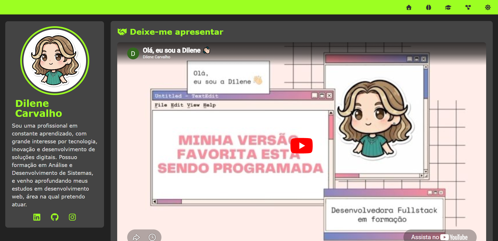

# Portifólio  

Projeto desenvolvido com HTML, CSS e JavaScript, com abordagem Mobile First, onde foi praticado responsividade, estrutura de múltiplas seções com organização de conteúdo usando Grid Layout e Flexbox, além do uso da opção "Modo Escuro". 

## Acesse online: 

[Projeto Portifolio](https://dilene-carvalho.github.io/estudos/projeto-portifolio/)

## Preview:

